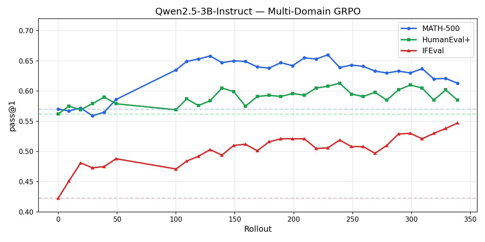
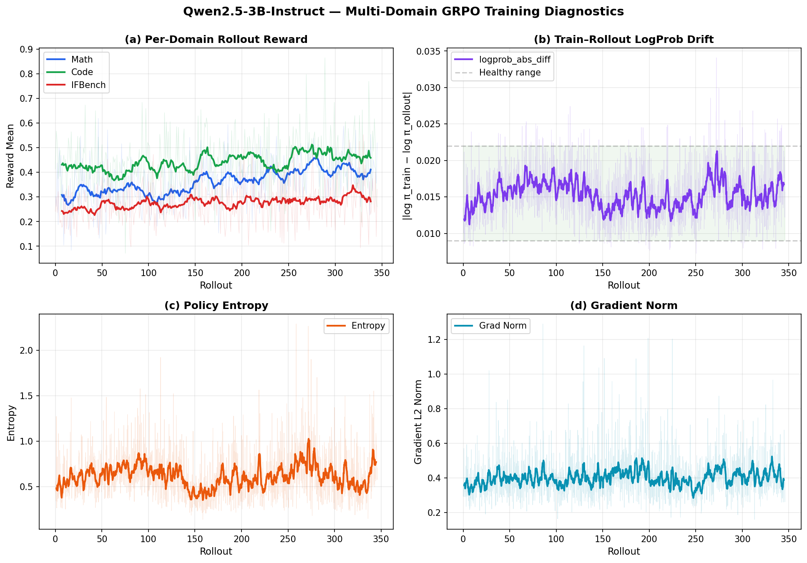

# Multi-Domain RL

Sample multi-domain/task GRPO training across **Math**, **Code**, and **Instruction Following** domains using Miles.

Tested with **Qwen2.5-3B-Instruct** on 8× MI325X GPUs (2 train + 6 rollout).

## Overview

Sample training data used:

| Domain | Training Data | Reward | Eval Benchmark |
|--------|--------------|--------|----------------|
| **Math** | MATH L1–L3 | Exact-match against ground truth (lenient: boxed, numeric, letter) | MATH-500 |
| **Code** | KodCode 10K | Execute-and-test with partial credit (avg 7.7 tests/problem) | HumanEval+ |
| **Instruction Following** | IFBench (1–2 constraints) | Per-constraint satisfaction via IFEvalG checker | IFEval |

Key design choices (with parameters similar to olmo3 RL):

- **GRPO with mean-only advantage normalization** (no std division) — harder domains naturally receive larger gradients
- **Domain-balanced batching** — round-robin interleaved data ensures every rollout batch mixes all domains
- **Per-token loss** (`--calculate-per-token-loss`) — DAPO-style, each token weighted equally regardless of sequence length
- **Asymmetric clipping** (`--eps-clip 0.2 --eps-clip-high 0.28`) — encourages exploration
- **Active sampling with prompt retirement:** Prompts that achieve a pass rate higher than 93.75% (i.e., passing 15 out of 16 recent attempts) are filtered out from further training. Adjust the retirement threshold as needed based on the GRPO group size.
- **No KL penalty** (`--kl-coef 0`)

## File Structure

```
multi-domain-rl/
├── run_qwen3b_multidomain_grpo.sh   # Launch script (Qwen2.5-3B, 8 GPUs)
├── reward_model.py                   # Multi-domain reward: math, code, ifbench
├── dynamic_sampling_filter.py        # Active sampling: zero-std + retirement filter
├── per_domain_logger.py              # Per-domain metrics to WandB + TSV
├── eval_with_flush.py                # Eval function with SGLang KV cache flush
├── eval_config.yaml                  # Eval datasets and generation params
├── prepare_balanced_data.py          # Data prep: round-robin domain interleaving
├── IFEvalG/                          # IFEval constraint checker library
│   ├── instructions.py               # Constraint implementations
│   ├── instructions_registry.py      # Constraint registry
│   └── instructions_util.py          # Utilities (keyword lists, etc.)
└── __init__.py
```

## Quick Start

### 1. Prepare checkpoints

```bash
# Edit paths in run_qwen3b_multidomain_grpo.sh:
HF_CHECKPOINT="/path/to/Qwen2.5-3B-Instruct"
MEGATRON_CKPT="/path/to/Qwen2.5-3B-Instruct_megatron"
```

### 2. Prepare training data

Suppose you want to train on three domains—math, code, and instruction following — with the proper routing by reward type. Here's how the JSONL data (after mixing and balancing) should look:

```json
{"prompt": [{"role": "user", "content": "Solve for x: 2x + 1 = 5."}], "label": "x = 2", "metadata": {"rm_type": "math"}}
{"prompt": [{"role": "user", "content": "Write a Python function that returns the sum of two numbers."}], "label": "def add(a, b): return a + b", "metadata": {"rm_type": "code"}}
{"prompt": [{"role": "user", "content": "Write a sentence containing exactly 5 words."}], "label": "The sun rises every day.", "metadata": {"rm_type": "ifbench"}}
```

To interleave and balance the data from raw domain files (e.g., `math.jsonl`, `code.jsonl`, `ifbench.jsonl`), run:

```bash
python examples/multi-domain-rl/prepare_balanced_data.py \
    --input data/combined_train.jsonl \
    --output data/balanced_train.jsonl
```

This ensures the batch sampler always sees domain-balanced batches, so each domain contributes equally during RL. Make sure your config or launch script points to the balanced file for training.

### 3. Prepare eval data

Edit `eval_config.yaml` to point to your eval JSONL files for MATH-500, HumanEval+, and IFEval. Each eval dataset needs the same `prompt`/`label`/`metadata` schema as training data.

### 4. Launch training

```bash
bash examples/multi-domain-rl/run_qwen3b_multidomain_grpo.sh
```

## Reward Functions

All reward functions are in `reward_model.py`, routed by `metadata.rm_type`:

- **`math`** — Multi-strategy answer extraction: `\boxed{}`, "Answer:" line, last number/letter. Uses Miles' `grade_answer_verl` with numeric normalization fallbacks. Binary 0/1.
- **`code`** — Extracts Python code from markdown blocks, runs against test cases with a 10s timeout. Supports assert-style, check()-style, and pytest-style tests. Partial credit = fraction of tests passed.
- **`ifbench`** — Checks constraint satisfaction using the IFEvalG library. **Partial credit during training** (fraction of constraints passed), **all-or-nothing during eval**.

All reward functions strip `<think>...</think>` reasoning blocks and apply a repetition penalty (4-gram repetition ratio > 0.5 → reward = 0).

## Training Configuration

| Parameter | Value | Notes |
|-----------|-------|-------|
| Algorithm | GRPO | Mean-only advantage (no std normalization) |
| Learning rate | 1e-6 | Constant schedule |
| Batch size | 24 prompts × 16 samples = 384 | 6 train steps per rollout |
| Response length | 2048 | Sufficient for instruct-style (non-think) models |
| Temperature | 1.0 | Rollout exploration |
| eps-clip | 0.2 / 0.28 | Asymmetric (DAPO-style) |
| KL penalty | 0.0 | No KL constraint |
| Loss | Per-token | DAPO-style token-mean loss |
| Gradient checkpointing | Full recompute (3 layers) | Reduces memory for 3B model |
| GPU layout | 2 train (TP=1, DP=2) + 6 rollout | Async training via `train_async.py` |
| Eval | Every 10 rollouts | 4 samples/prompt at temp=0.6 |

## Results: Qwen2.5-3B-Instruct (8× MI325X, 345 rollouts)

### Eval pass@1



Dashed lines show the baseline (rollout 0) for each domain. **Peak gains over baseline**: Math +9.0 pts, Code +4.6 pts, IFEval +12.4 pts.

### Training metrics:




